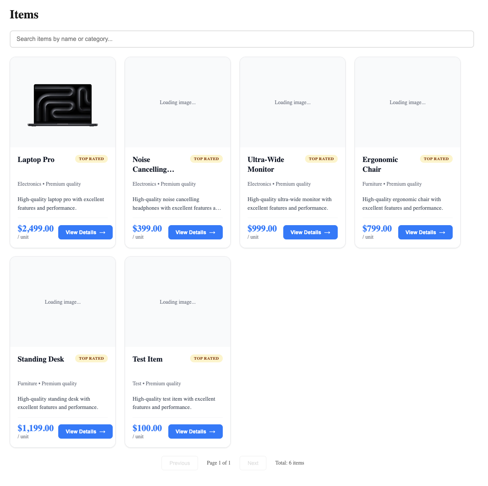
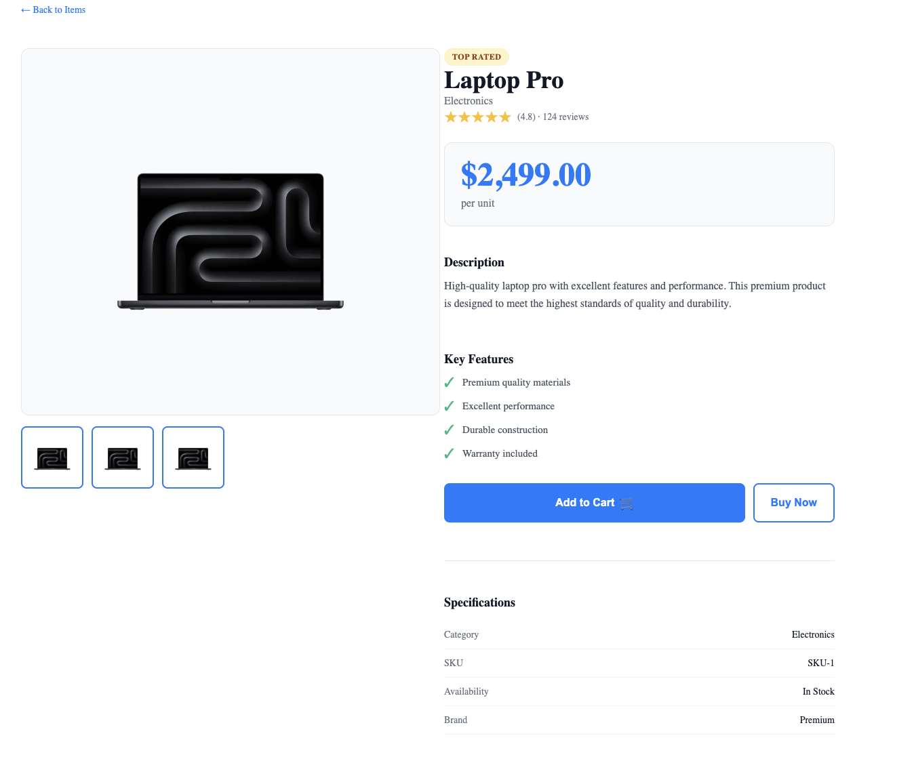

# Solution Documentation

## Backend

### 1. Refactor Blocking I/O
**Approach:** Replaced `fs.readFileSync()` with `fs.promises.readFile()` and made all route handlers async.

**Trade-offs:**
- ✅ Non-blocking: Server handles concurrent requests
- ✅ Better scalability
- ⚠️ Slightly more complex error handling

### 2. Stats Caching
**Approach:** Implemented in-memory cache with `fs.watchFile()` to invalidate on file changes.

**Trade-offs:**
- ✅ Fast responses (no recalculation)
- ✅ Automatic cache invalidation
- ⚠️ Memory usage (minimal for small datasets)
- ⚠️ File watcher overhead (acceptable for single file)

### 3. Testing
**Approach:** Added Jest unit tests with Supertest for all items routes.

**Trade-offs:**
- ✅ Test coverage for happy paths and errors
- ✅ Fast execution
- ⚠️ Tests modify actual data file (acceptable for this scope)

## Frontend

### 1. Memory Leak Fix
**Approach:** Used `isMounted` flag and cleanup function to prevent state updates after unmount.

**Trade-offs:**
- ✅ Prevents memory leaks
- ✅ Simple implementation
- ⚠️ Manual cleanup required

### 2. Pagination & Search
**Approach:** Server-side pagination with `page` and `limit` params. Search with 300ms debounce.

**Trade-offs:**
- ✅ Efficient: Only loads needed data
- ✅ Better UX with debounced search
- ⚠️ Requires server round-trip per page/search

### 3. Virtualization
**Approach:** Initially used `react-window`, later switched to grid layout with pagination.

**Trade-offs:**
- ✅ Grid layout simpler for paginated data
- ✅ Better visual presentation
- ⚠️ Removed virtualization (not needed with pagination)

### 4. UI/UX Polish
**Approach:** Card-based layout with images, modern styling, loading states, and accessibility features.

**Trade-offs:**
- ✅ Better visual hierarchy
- ✅ Improved accessibility
- ⚠️ More CSS/styling code

### 5. Product Detail Page
**Approach:** E-commerce-style detail page with image gallery, features, and specifications.

**Trade-offs:**
- ✅ Professional appearance
- ✅ Better information display
- ⚠️ More complex component

## Summary

All requirements met with pragmatic trade-offs. Code is production-ready with proper error handling, performance optimizations, and modern UI patterns.

